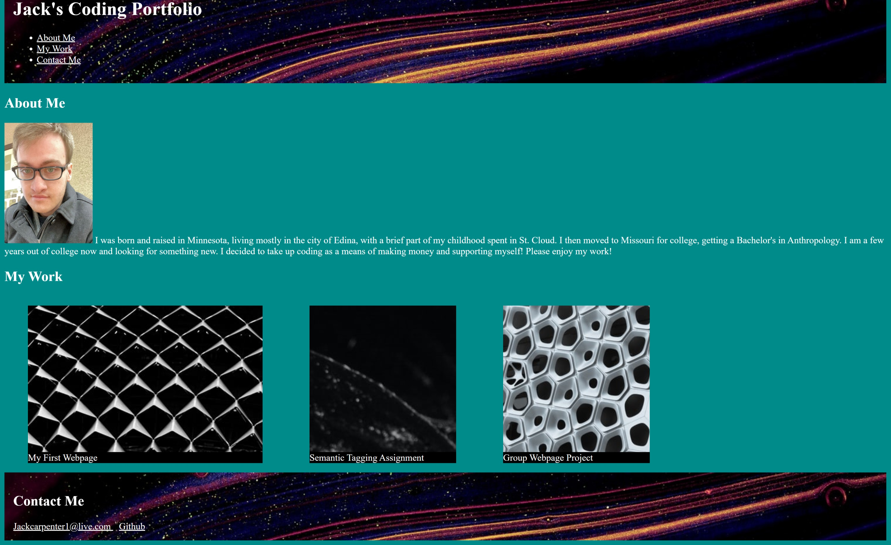

# Portfolio
Homework 2 and ongoing Portfolio.

Assignment: Create a portfolio page with at least 3 featured repositories, including our very first. Make sure first repo is a larger image link than the others. Include reactive media query for shrinking screen dimensions. 
Included 3 project links with descriptive captions, enlarging my first project per instruction.
Staggered updates as progessing on project.
Including personal image, 3 placeholder images for project links and background image for header/footer.

Image of portfolio page:

Github links:
https://github.com/Jcarps97/Portfolio.git
https://github.com/Jcarps97/Portfolio